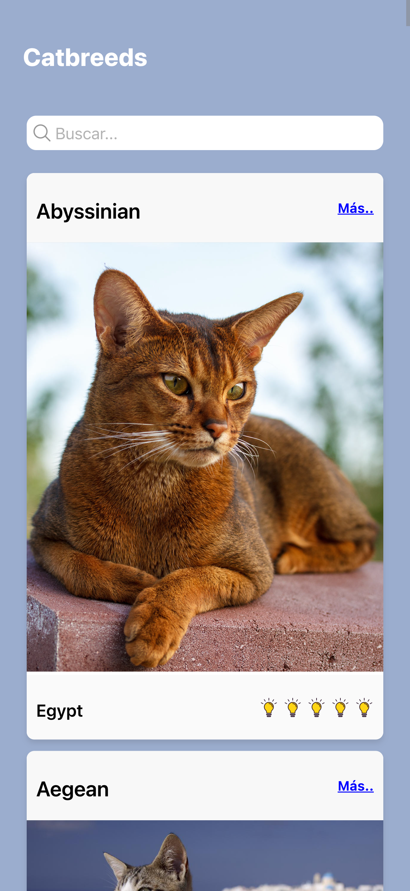
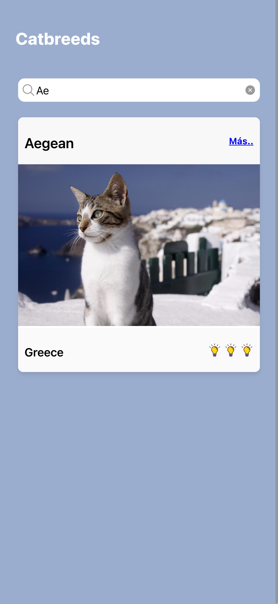
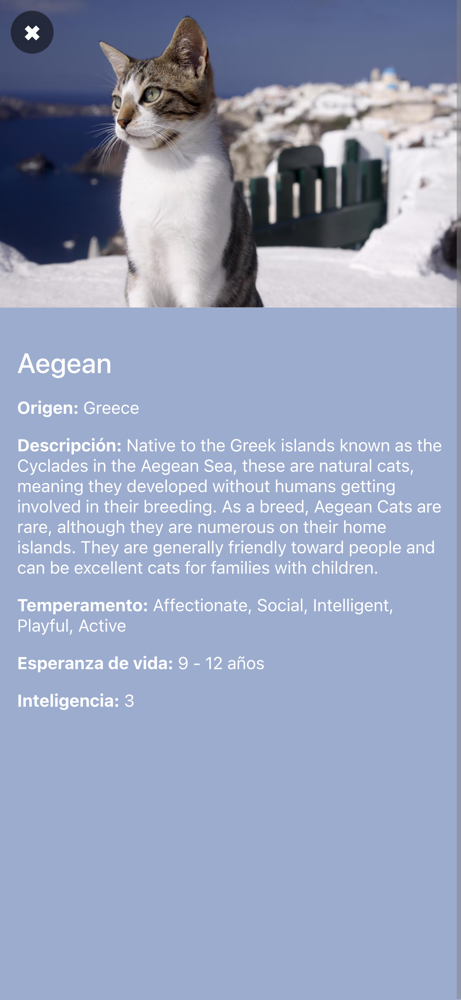

# Catbreeds

Una app para buscar razas de gato


### Comandos iniciales

Instalar dependencias 

`npm istall`

Correr el aplicativo 

`iconic serve`

### estructura de carpetas

```
└── 📁src
    └── 📁app
        └── app-routing.module.ts
        └── app.component.html
        └── app.component.scss
        └── app.component.spec.ts
        └── app.component.ts
        └── app.module.ts
    └── 📁application
        └── 📁services
            └── cat.service.ts
        └── 📁use-cases
            └── get-cat-id.use-case.ts
            └── get-cats.use-case.ts
    └── 📁assets
        └── 📁icon
            └── favicon.png
        └── 📁img
            └── bombilla.png
            └── splash.png
        └── shapes.svg
    └── 📁domain
        └── 📁entities
            └── cat.ts
        └── 📁repositories
            └── cat.repository.ts
    └── 📁environments
        └── environment.prod.ts
        └── environment.ts
    └── 📁infrastructure
        └── 📁api
        └── 📁repositories
            └── cat-api.repository.ts
        └── 📁storage
    └── 📁presentation
        └── 📁components
            └── 📁card
                └── card.component.html
                └── card.component.scss
                └── card.component.ts
            └── 📁search
                └── search.component.html
                └── search.component.scss
                └── search.component.ts
        └── 📁pages
            └── 📁detail
                └── detail-routing.module.ts
                └── detail.module.ts
                └── detail.page.html
                └── detail.page.scss
                └── detail.page.spec.ts
                └── detail.page.ts
            └── 📁home
                └── home-routing.module.ts
                └── home.module.ts
                └── home.page.html
                └── home.page.scss
                └── home.page.spec.ts
                └── home.page.ts
            └── 📁splash
                └── splash-routing.module.ts
                └── splash.module.ts
                └── splash.page.html
                └── splash.page.scss
                └── splash.page.spec.ts
                └── splash.page.ts
    └── 📁theme
        └── variables.scss
    └── global.scss
    └── index.html
    └── main.ts
    └── polyfills.ts
    └── test.ts
    └── zone-flags.ts
```

### Arquitectura limpia 

`app (Core)`

Contiene la configuración general del proyecto.

Aquí van módulos compartidos, guards e interceptores.

`application (Capa de Aplicación)`

Contiene los casos de uso y servicios de aplicación.

Los casos de uso encapsulan la lógica de negocio de forma independiente.

`domain (Dominio)`

Define las entidades y repositorios en abstracto.

No contiene lógica de implementación.

`infrastructure (Infraestructura)`

Implementa los repositorios, API calls, y almacenamiento local.

`presentation (Presentación)`

Contiene las páginas, componentes y ViewModels.

### Capturas 





